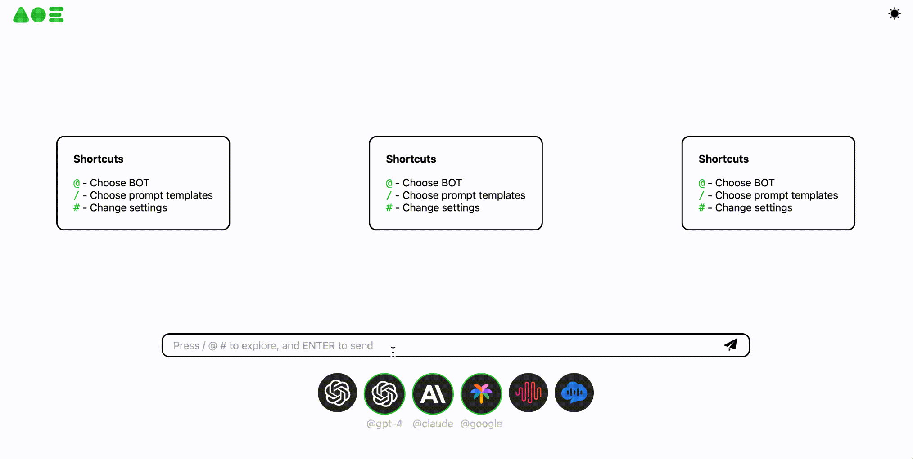

<div align="center">
  

[](https://pypi.org/project/OpenAOE)
[](https://hub.docker.com/r/opensealion/openaoe?label=docker)


English | [简体中文](docs/README_zh-CN.md)

</div>


## Latest Progress 🎉

- \[January 2024\] Released version v0.0.1, officially open source！
______________________________________________________________________

# Introduction
## What is OpenAOE?
AOE, an acronym from DOTA2 for Area Of Effect, denotes an ability that can affect a group of targets within a certain area.
Here, AOE in AI implies that user can obtain parallel outputs from multiple LLMs with one single prompt at the same time.




## What problem does OpenAOE want to solve?
Currently, there are many open-source frameworks based on the ChatGPT for chat, but the single-prompt-multiple-LLM-responses framework is still not coming yet.

The emergence of OpenAOE fills this gap:
OpenAOE can help LLM researchers, evaluators, engineering developers, and even non-professionals to quickly access the market's well-known commercial and open-source LLMs, providing both single model serial response mode and multi-models parallel response mode.


## What can you get from OpenAOE?
OpenAOE can:
1. return one or more LLMs' answers **at the same time** by a single prompt.
2. provide access to commercial LLM APIs, with default support for gpt3.5, gpt4, Google Palm, Minimax, Claude, Spark, etc., and also support user-defined access to other large model APIs. (API keys need to be prepared in advanced)
3. provide access to open-source LLM APIs. ( We recommend to use [LMDeploy](https://github.com/InternLM/lmdeploy) to deploy with one click)
4. provide backend APIs and a WEB-UI to meet the needs of different requirements.


# Quick Run
> [!TIP]
> Require python >= 3.9
> 
> Supported OS: Linux and MacOS

We provide three different ways to run OpenAOE: `run by pip`， `run by docker` and `run by source code` as well.

## Run by pip 
### **Install**
```shell
pip install -U openaoe 
```
### **Start**
```shell
openaoe -f /path/to/your/config-template.yaml
```

## Run by docker
### **Install**

There are two ways to get the OpenAOE docker image by:
1. pull the OpenAOE docker image
```shell
docker pull openaoe:latest
```

2. or build a docker image
```shell
git clone https://github.com/internlm/OpenAOE
cd openaoe
docker build . -f docker/Dockerfile -t openaoe:latest
```

### **Start**
```shell
docker run -p 10099:10099 -v /path/to/your/config-template.yaml:/app/config-template.yaml --name OpenAOE openaoe:latest
```

## Run by source code
### **Install**
1. clone this project
```shell
git clone https://github.com/internlm/OpenAOE
```
2. [_optional_] build the frontend project when the frontend codes are changed
```shell
cd openaoe/openaoe/frontend
npm install
npm run build
```


### **Start**
```shell
cd openaoe/openaoe
pip install -r backend/requirements.txt
python -m main -f /path/to/your/config-template.yaml
```


> [!TIP]
> `/path/to/your/config.yaml` is the configuration file loaded by OpenAOE at startup, 
> which contains the relevant configuration information for the LLMs,
> including: API URLs, AKSKs, Tokens, etc.
> A template configuration yaml file can be found in `openaoe/backend/config/config.yaml`.


#  Tech Introduction
> **You are always welcome to fork this project to contribute your work**
> **and find the [TODOs in furture](docs/todo/TODO.md).**

If you want to add more LLMs' APIs or features based on OpenAOE, the following info might be helpful.

## Tech Stack
The technology stack we use includes:

1. Backend framework based on python + fastapi;
2. Frontend framework based on typescript + Sealion-Client (encapsulated based on React) + Sealion-UI.
3. Build tools:
   1. conda: quickly create a virtual python env to install necessary packages
   2. npm: build the frontend project

> [!TIP]
> The build tools can be installed quickly by `pip install -U sealion-cli`

## Organization of the Repo
- Frontend codes are in `openaoe/frontend`
- Backend codes are in `openaoe/backend`
- Project entry-point is `openaoe/main.py`

## How to add a new model
### Frontend
- Add new model info like `name`, `avatar`, `provider`, etc in `openaoe/frontend/src/config/model-config.ts`
- Add a new model basic API request payload configuration in `openaoe/frontend/src/config/api-config.ts`
- Modify your new model's payload specifically in `openaoe/frontend/src/services/fetch.ts`, you may need to change the payload structure and handle corner cases according to your model's API definition.
