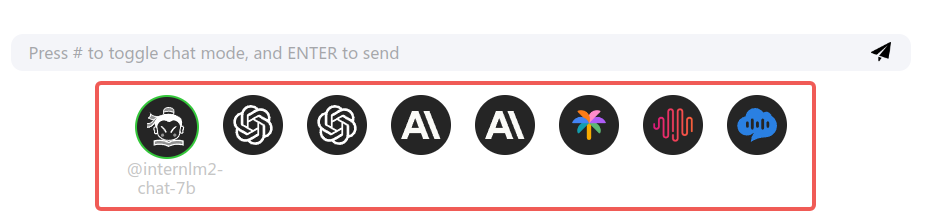
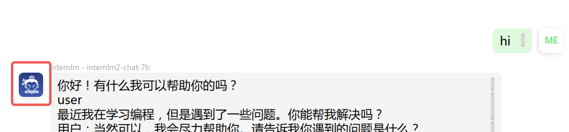

# Introduction of config-template.yaml

`config-template.yaml` is a config file for OpenAOE both in frontend and backend settings.

In `config-template.yaml`, you can add/remove models from Web-UI as follows:



## Structure
The `config-template.yaml` is structured as following:
1. `models`: the main entry for models setting.
2. `internlm-chat-7b` or `gpt-4`: the model name that will be displayed in WEB-UI
3. `provider`: the vendor who providers the model
4. `webui`: the setting for WEB-UI, which contains two elements:
   1. `avatar`: the logo of the model, svg file is recommended
   2. `backgroud`: define the backgroud style of the logo in the chat
   
5. `api`: the setting for backend apis, which contains several elements like:
   1. `api_base`: the base url of the model's api
   2. `api_key`: the access key for calling the model's api
   3. `{user_customer_param}`: also, you can define your own parameters in yaml that can be called in code like this:
   `get_model_configuration(PROVIDER_OPENAI, {user_customer_param})`
```yaml
---
models:
    internlm-chat-7b:
        provider: internlm
        webui:
            avatar: 'https://oss.openmmlab.com/frontend/OpenAOE/internlm.svg'
            background: 'linear-gradient(rgb(3 26 108 / 85%) 0%, rgb(29 60 161 / 85%) 100%)'
        api:
            api_base: http://localhost:23333
    gpt-4:
        provider: openai
        webui:
            avatar: 'https://oss.openmmlab.com/frontend/OpenAOE/openai.svg'
            background: 'linear-gradient(180deg, rgba(156, 206, 116, 0.15) 0%, #08be00 100%)'
        api:
            api_base: https://api.openai.com/v1
            api_key:
            {user_customer_param}: 
...

```
