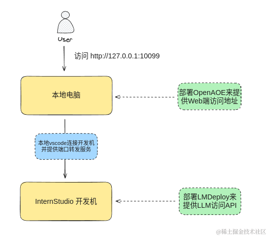
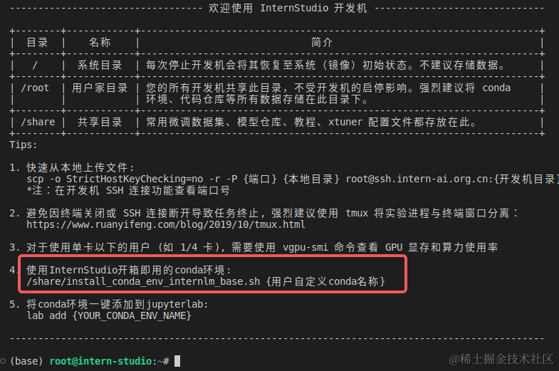
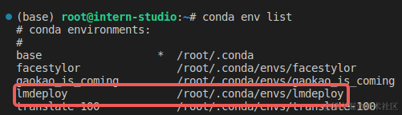
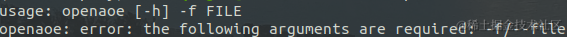
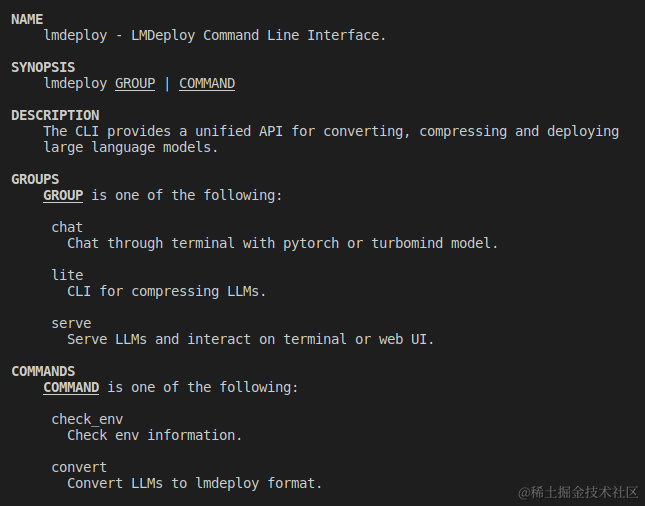
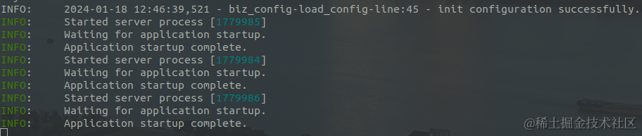
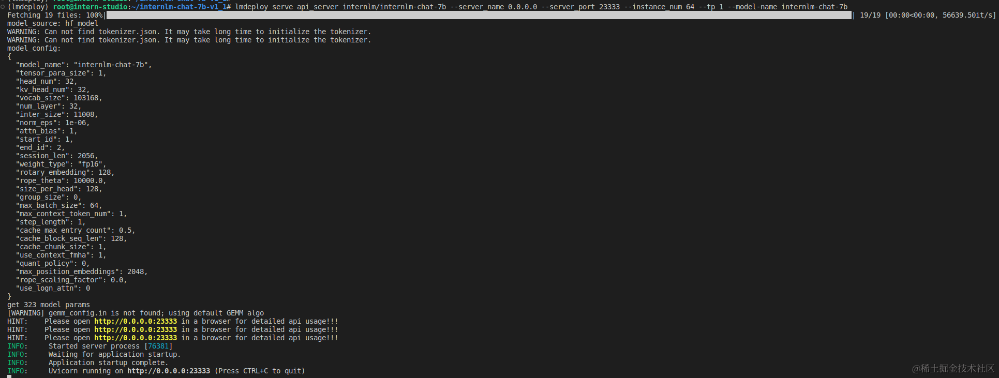
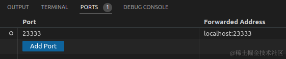

> [原文](https://juejin.cn/post/7325040809698607104)
# 0 | 前言
在这个大语言模型（LLM）百花齐放的时代，出现了很多开源的、商业的、免费的、收费的大模型，在探索这些大模型无限可能性的时候，我们常常对那些能够直观呈现成果的工具感到兴奋。

今天， 给大家分享一个这样的框架工具—— **[OpenAOE](https://github.com/InternLM/OpenAOE)，一个前沿的大语言模型群聊框架 (LLM Group Chat Framework: chat with multiple LLMs at the same time)**。

通过 [OpenAOE](https://github.com/InternLM/OpenAOE) 可以很方便地与不同的大语言模型进行**单聊和群聊**。它同时支持接入商业大模型（需用户自行提供Token）和 开源的大语言模型。 本篇文章，主要介绍如何使用 [LMDeploy](https://github.com/InternLM/lmdeploy) 来部署开源的大模型，然后接入 OpenAOE，进行聊天。


# 1 | 安装部署
先看下部署架构，有一个整体的印象




**【说明】**
1. 我们的环境和部署都会基于Linux系统进行 (Windows和MacOS系统同样支持)
2. 考虑到大模型的部署对显卡要求比较高（InternLM-Chat-7B 模型起来就需要将近 16GB 的显存），我们会借助 InternStudio 来部署模型。当然如果本地电脑显卡配置比较高的话，模型也可以在本地 serving。


> 这里的 [InternStudio](https://studio.intern-ai.org.cn) 是一个AI开放平台，参加他们的课程，可以提供免费的 A100 GPU 使用时间。


## 1.1 | 环境准备
### 1.1.1 | 安装 conda
安装 conda 是为了管理和隔离 python 环境，来避免不同项目之间安装 相同包不同版本 导致的冲突。（如果本地已经有conda环境或者python环境，可以跳过）

**本地**
 ```
# 安装 miniconda
mkdir -p ~/miniconda3
wget https://repo.anaconda.com/miniconda/Miniconda3-latest-Linux-x86_64.sh -O ~/miniconda3/miniconda.sh
bash ~/miniconda3/miniconda.sh -b -u -p ~/miniconda3
rm -rf ~/miniconda3/miniconda.sh
# 初始化bash 或者 zsh
~/miniconda3/bin/conda init bash
~/miniconda3/bin/conda init zsh
```


### 1.1.2 | 创建python虚拟环境并初始化
**本地**

创建一个python版本是3.10的虚拟环境 openaoe
```
conda create -n openaoe python==3.10
```

**studio开发机**
启动开发机后，可以看到



InternStudio 平台提供了一键初始化 conda 环境的命令, 我们可以创建一个新的 conda 环境，命名为 lmdeploy：
```
studio-conda lmdeploy
```
安装成功后，执行
```
conda env list
```
可以看到环境准备就绪：


### 1.1.3 | 安装 OpenAOE
**本地**

激活上面创建的 conda 环境： openaoe
```
conda activate openaoe
```
安装 OpenAOE
```
pip install -U openaoe -i https://pypi.org/simple
```
执行`openaoe`，看到如下界面，表示安装成功




### 1.1.4 | 安装 LMDeploy
**studio开发机**
```
pip install packaging
pip install /root/share/wheels/flash_attn-2.4.2+cu118torch2.0cxx11abiTRUE-cp310-cp310-linux_x86_64.whl
pip install 'lmdeploy[all]==v0.1.0'
```
执行 `lmdeploy -h`, 看到如下界面，表示安装成功



## 1.2 | 部署
### 1.2.1 | 部署 OpenAOE
**本地**
```
conda activate openaoe # 如果本地的conda环境不在openaoe，需要执行这段命令
openaoe -f config.yaml
```
这里 `config.yaml` 配置如下：
```
---
models:
    internlm:
        api_base: http://localhost:23333
...

```
启动成功界面



### 1.2.3 | 部署 LMDeploy
**studio开发机**

这里我们会借助 vscode 连接到 InternStudio 的开发机（为了使用其远程端口转发能力）, 具体教程可以参考 [这篇文章](https://aicarrier.feishu.cn/wiki/VLS7w5I22iQWmTk0ExpczIKcnpf)。

配置 vscode ssh config 如下：
```
Host ssh.intern-ai.org.cn
  HostName ssh.intern-ai.org.cn
  StrictHostKeyChecking no
  Port 35278
  UserKnownHostsFile /dev/null
  User root
```
进入开发机执行
```
export HF_ENDPOINT=https://hf-mirror.com
lmdeploy serve api_server internlm/internlm-chat-7b --server_name 0.0.0.0 --server_port 23333 --instance_num 64 --tp 1 --model-name internlm-chat-7b #
```
上面的参数中 `server_name` 和 `server_port` 分别表示服务地址和端口，`tp` 表示 Tensor 并行。还剩下一个 `instance_num` 参数，表示实例数，可以理解成 Batch 的大小。执行后如下图所示。


**注意：这里的 http://0.0.0.0:23333 是开发机内访问的一个地址，在本地浏览器上是无法访问的**

通过 vscode 配置端口转发，将开发机的23333端口转发到本地的23333端口



这样，我们就可以在本地访问 http://localhost:23333 来请求 InternStudio 开发机里通过 LMDeploy 提供推理服务的 API 了。

以上。

